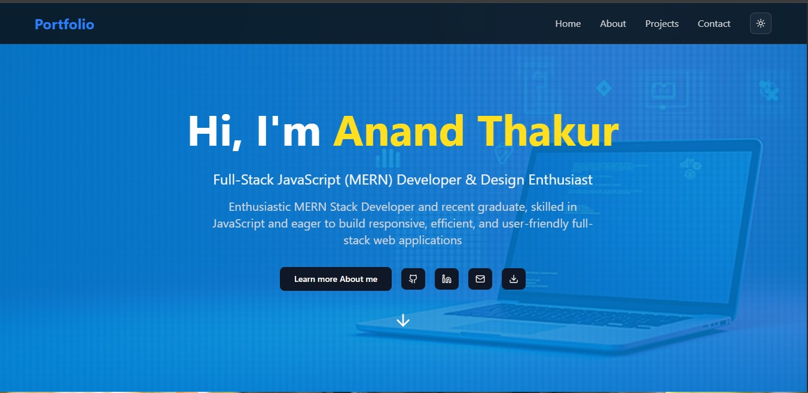

# 🌐 Anand Thakur | MERN Stack Developer Portfolio

Welcome to my **personal portfolio website**, built using the **MERN stack** and **modern React practices**.  
It showcases my projects, technical skills, and professional background as a web developer.

---

## 🚀 Features

- ⚡ **Modern UI** built with React + Tailwind CSS  
- 🧠 **Dynamic Components** and responsive design  
- 📩 **Contact Form** integrated with EmailJS (with reCAPTCHA verification)  
- 📄 **Download Resume** button  
- 🌙 **Dark mode ready** (optional if implemented)

---

## 🛠️ Tech Stack

| Technology | Description |
|-------------|-------------|
| **React.js** | Frontend library for building user interfaces |
| **Tailwind CSS** | Utility-first CSS framework for responsive design |
| **EmailJS** | Send emails directly from the website |


---

## 🧑‍💻 Sections

- **Home** – Intro, profile image, and short bio  
- **About** – Education, experience, and skills overview  
- **Projects** – Display of my latest web development work  
- **Contact** – Email form (sends messages directly to my Gmail)  
- **Download Resume** – Direct link to my latest resume (PDF)

---

## 📸 Preview



---

## ⚙️ Setup & Installation

1. Clone the repository  
   ```bash
   git clone https://github.com/your-username/portfolio.git

2.Navigate to the project directory

cd portfolio


3.Install dependencies

npm install


4.Create a .env file in the project root and add your environment variables:

VITE_EMAILJS_SERVICE_ID=your_service_id
VITE_EMAILJS_TEMPLATE_ID=your_template_id
VITE_EMAILJS_PUBLIC_KEY=your_public_key
VITE_RECAPTCHA_SITE_KEY=your_site_key


5.Run the development server

npm run dev
